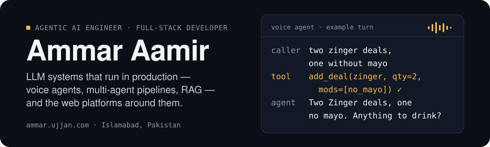

  

I build LLM-powered systems that run in production — telephony voice agents, multi-agent grading pipelines, voice-to-voice RAG tutors — and the Next.js / FastAPI / Laravel platforms around them. Co-Founder & AI Solutions Architect at [Ujjan](https://ujjan.com), where I take client problems from the first conversation to a system in production. I also teach Agentic AI at PIAIC and Panaversity.

## Work

Most of this is client or product work in private repositories. Live links where they exist; I'm happy to walk through any of it.

**Voice Agent Platform** — phone ordering agent for restaurants: inbound and outbound calls over SIP, two interchangeable pipelines (STT → LLM → TTS and OpenAI Realtime audio-to-audio), 11 order tools, a deterministic cart engine with integer-cent pricing whose validation errors become clarifying questions, repeat-caller memory, and replay tests against real customer utterances.
`LiveKit Agents · Twilio/Telnyx SIP · Deepgram · ElevenLabs · OpenAI Realtime · FastAPI · PostgreSQL`

**Evalio** — AI grading platform for teachers: LLM-generated rubric with 4 quality bands, parallel evidence-cited grading of PDF/DOCX submissions and GitHub repositories (sandboxed, path-traversal-hardened file tools), then Reconciler and Fairness Auditor agents that cross-check scores and flag likely copying for human review. Traced end to end with Langfuse over OpenTelemetry.
`FastAPI · OpenAI Agents SDK · Gemini · OpenRouter · Next.js · Neon · Drizzle · Langfuse`

**AI Tutor** (for [Promptiles](https://promptiles.com), Switzerland) — push-to-talk teacher: the LLM decides via tool calling whether to search course material in pgvector, and transcript, gesture cues, visemes and PCM audio stream over a single SSE response so the first sentence plays while the last is still generating. The teacher is a browser-side WebGL2 sprite-atlas puppet (42 layers, viseme lip-sync, gaze tracking) — no avatar service, no per-minute video cost.
`Next.js · OpenRouter · ElevenLabs · pgvector on Neon · WebGL2`

**[Tajassum](https://tajassum.com)** — AI marble visualization SaaS: a room photo plus per-surface marble selections becomes a photorealistic render. Benchmarked 8 image-editing models on fidelity, cost and latency to define a 3-tier pricing model; built the prepaid credit ledger, admin console and a feature-flagged Cloudflare R2 media layer.
`Next.js · Neon Postgres · OpenRouter image models · Cloudflare R2`

**[Promptiles](https://promptiles.com)** — grew a prompt-generator SaaS into a full platform: role- and plan-based auth, an admin bulk-upload pipeline for the prompt taxonomy, a 12-module course library and mentorship booking.
`Next.js 16 · Vercel AI SDK · better-auth · Neon`

**ATIR case management** (Appellate Tribunal Inland Revenue, Government of Pakistan) — re-architected the tribunal's case-management system from PHP to Laravel 12 / Inertia / PostgreSQL, leading back-end design in a 3-person team: 10-role permission model, end-to-end appeal lifecycle, audit logging, PDF/Excel reporting, WhatsApp notifications, GitHub Actions CI/CD to a production VPS.
`Laravel 12 · Inertia/React · PostgreSQL · GitHub Actions`

Also: an AR restaurant menu with a USDZ-to-GLB asset pipeline, and client websites for businesses in New Zealand, Switzerland and the UK (Next.js 16, React 19, Tailwind v4, GSAP, React Three Fiber, Sanity CMS).

## Teaching

Technical Instructor at **PIAIC** (Agentic AI: OpenAI Agents SDK, RAG, multi-agent workflows; TypeScript, Python, full-stack) and Instructor at **Panaversity** (spec-driven development and custom AI-agent building). The course material is public:

- [PIAIC_Batch_73_OpenAI_Agents_SDK](https://github.com/AmmarAamir786/PIAIC_Batch_73_OpenAI_Agents_SDK) — OpenAI Agents SDK, class by class: setup, tools, context, streaming, tracing, handoffs vs agent-as-tool
- [p011](https://github.com/AmmarAamir786/p011) — spec-driven development exercises and capstone briefs
- [openai_agents_sdk](https://github.com/AmmarAamir786/openai_agents_sdk) — Agents SDK playground with a Chainlit front-end and RAG examples
- [Learn_LangGraph_With_Me](https://github.com/AmmarAamir786/Learn_LangGraph_With_Me) — annotated notes and code from the LangGraph Academy course

## Stack

Python, TypeScript, PHP · OpenAI Agents SDK, LangGraph, MCP, RAG (pgvector, Qdrant, Chroma), Langfuse · LiveKit, OpenAI Realtime, Deepgram, ElevenLabs · Next.js 16, React 19, Tailwind v4, Three.js · FastAPI, Laravel 12, PostgreSQL, Kafka, Docker · GitHub Actions, Vercel, Cloudflare R2

## Now

**Sep 2026** — shipping the Promptiles AI Tutor and Evalio's GitHub-repository grading; teaching Agentic AI and spec-driven development at PIAIC and Panaversity.

## Elsewhere

**Portfolio: [ammar.ujjan.com](https://ammar.ujjan.com)** · [LinkedIn](https://linkedin.com/in/ammaraamir786) · [ammaraamir609@gmail.com](mailto:ammaraamir609@gmail.com)

<!--
Owner: Ammar Aamir. Last reviewed: 2026-09-15.
Review this page when: a project ships or goes live, a role or title changes, a job search starts or ends.
Facts here must match the resume and LinkedIn (see the resume workspace README, "GitHub sync").
-->
